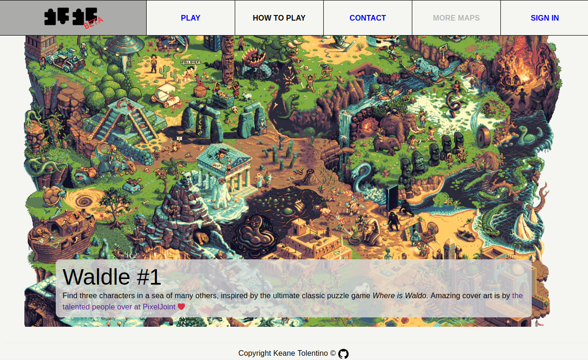

  <h1 align="center">Waldle</h1>
  

    <strong>Tune in weekly to find three characters having only six tries in Walde, a Wordle-inspired Where is Waldo game.</strong>
       
    <a href="https://playwaldle.xyz" target="_blank"><strong>Live Preview »</strong></a>
      
  

## About The Project

This was supposedly the last project for the JavaScript module of The Odin Project course, but I made it into my own project and learned TypeScript and NextJS along the the way.

### Made With

1. TypeScript
2. NextJS
3. Firebase
4. MaterialUI

### Things I Learned

1. TypeScript
2. NextJS
3. Firebase
4. Working with APIs

### Areas of improvement

1. Firebase Authentication flow
2. First Load JS shared by all

## Disclaimer

The resources I used, specifically the custom fonts installed, backgrounds, pictures, and the svg icons are only utilized for personal use, and not otherwise.

## Contact

Keane Andre - @keaneatl (Instagram, Facebook) - <a href="mailto:kyntltntn@protonmail.com">kyntltntn@protonmail.com</a>
